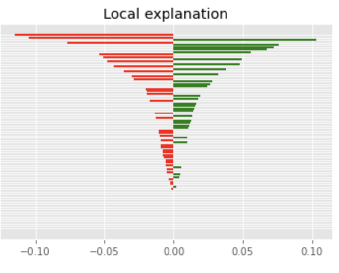

# HousingPrice
<br></br>
[](mailto:reejung.kim@gmail.com) 
[](https://www.linkedin.com/in/reejungkim/) 
[](https://reejungkim.github.io/)
<br></br>

This repository is divided into two parts

[Kaggle - predict housing prices](https://www.kaggle.com/c/house-prices-advanced-regression-techniques/overview)


### 1. House pricing prediction using standard ML models installed in scikit-learn
```
conda install -c conda-forge lightgbm 
conda install -c conda-forge xgboost
```

    - model candiates: random forest regression, support vector regression, gradient boosting regression
    - preprocessor: label encoder, robust scaler, normalizer
    - Evaluation method: Root-Mean-Squared-Error (RMSE)
    - Optimizer: GridSearchCV
    - model interpretation: feature importance, local interpretable model-agnostic explanations (LIME)
  
   
    
  [See jupyter notebook](Kaggle%20-%20House%20Prices%20ML.ipynb)
   
   - Final submission:  [Submission.csv](https://raw.githubusercontent.com/reejungkim/HousingPrice/master/submission.csv)
   - RMSE score: 0.13615


### 2. Housing pricing prediction using Tensorflow


```
pip install tensorflow
```

  [See jupyter notebook](Boston%20housing%20price%20using%20tensorflow.ipynb)
  

