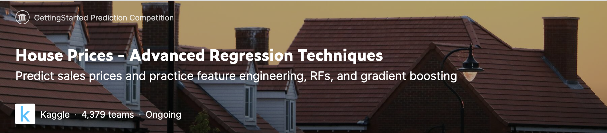
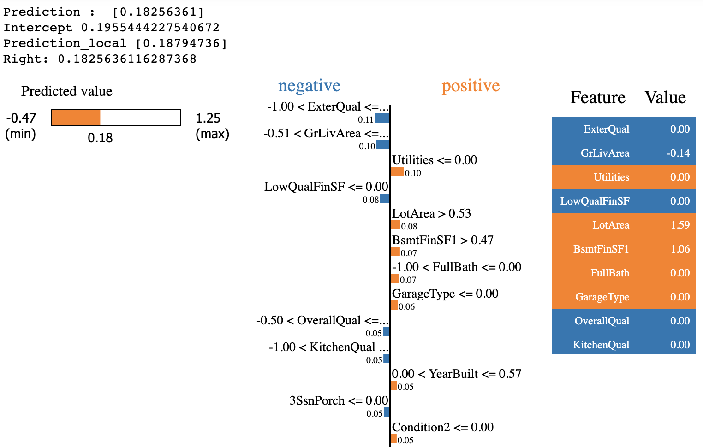
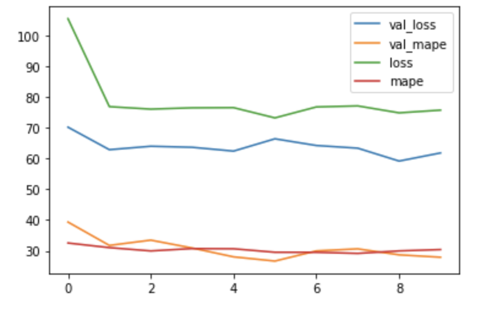

# HousingPrice
[Kaggle - predict housing prices](https://www.kaggle.com/c/house-prices-advanced-regression-techniques/overview)

Evaluation method: Root-Mean-Squared-Error (RMSE)





```
conda install -c conda-forge lightgbm 
conda install -c conda-forge xgboost
```

This repository is divided into two parts

### 1. House pricing prediction using standard ML models installed in scikit-learn
    - random forest regression
    - support vector regression
    - gradient boosting regression
    - Optimizer: GridSearchCV
    - model interpretation: LIME
  
   
    
  [See jupyter notebook](Kaggle%20-%20House%20Prices%20ML.ipynb)
   
   - Final submission:  [Submission.csv](https://raw.githubusercontent.com/reejungkim/HousingPrice/master/submission.csv)
   - RMSE score: 0.13615


### 2. Housing pricing prediction using Tensorflow

  [See jupyter notebook](Boston%20housing%20price%20using%20tensorflow.ipynb)
  

